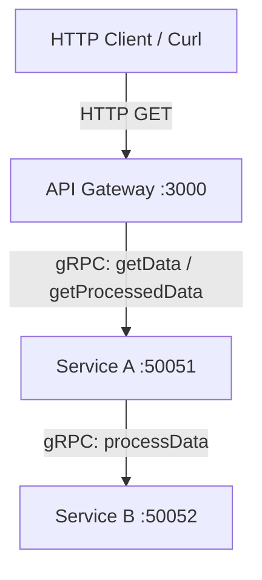

# gRPC Node.js Setup Template with Buf

An educational sample repository demonstrating a gRPC microservice architecture in Node.js, utilizing **Buf** for schema management, remote code generation, and contract registry integration.

---

## Architecture Overview



1. **API Gateway (Express)**: Exposes HTTP endpoints and acts as the entry point, communicating with Service A via gRPC.
2. **Service A (gRPC Server/Client)**: Handles requests from the API Gateway and forwards certain tasks to Service B via gRPC.
3. **Service B (gRPC Server)**: Performs downstream processing (uppercase conversion) and returns results to Service A.

---

## Directory Structure

```text
├── proto/                    # Protobuf schema files (.proto)
├── gen/js/                   # Generated CommonJS and gRPC stub files (ignored in Git)
├── api-gateway/              # Express-based entry point server
├── service-a/                # Service A gRPC server
├── service-b/                # Service B gRPC server
├── buf.yaml                  # Buf module configuration
├── buf.gen.yaml              # Buf code generation template
├── package.json              # Shared project dependencies (CommonJS)
└── README.md
```

---

## Buf Integration & Schema Registry

This project uses the [Buf CLI](https://buf.build/) to manage protobuf contracts and automate compilation.

### 1. Module Configuration (`buf.yaml`)
Defines the `proto` folder as the source directory for schemas and names the module for the Buf Schema Registry (BSR):
```yaml
version: v2
modules:
  - path: proto
    name: buf.build/kitty-org-123/test-kitty-123
```

### 2. Code Generation (`buf.gen.yaml`)
Configures remote code generation using official plugins, outputs the generated files to `gen/js`, and enforces CommonJS modules:
* **JS compiler**: `buf.build/protocolbuffers/js` (v4.0.2) using options `import_style=commonjs` and `binary`.
* **Node gRPC compiler**: `buf.build/grpc/node` (v1.13.1) using the `grpc_js` option.

### Useful Buf Commands
* **Push the schema to Buf Registry**:
  ```bash
  buf push
  ```
* **Generate Javascript/gRPC files locally**:
  ```bash
  buf generate
  ```

---

## Dependency Setup

To simplify dependency resolution and avoid `TypeError: Channel credentials must be a ChannelCredentials object` issues caused by duplicate module instances:
- Dependencies are centralized in the **root package.json**.
- Individual services (`api-gateway`, `service-a`, `service-b`) do not maintain their own `node_modules` folders. They naturally resolve up to the root level.
- Code is written using standard CommonJS (`require()`) to align with the generated BSR stubs.

---

## Running the Services

### 1. Install Dependencies
Run from the root directory:
```bash
npm install
```

### 2. Start the Servers
Open three terminal windows (or run in background) and start the services in order:

* **Start Service B**:
  ```bash
  node service-b/server.js
  ```
* **Start Service A**:
  ```bash
  node service-a/server.js
  ```
* **Start API Gateway**:
  ```bash
  node api-gateway/server.js
  ```

### 3. Test Endpoints
With all servers running, test the flow via HTTP requests:

* **Direct query to Service A**:
  ```bash
  curl "http://localhost:3000/data?q=hello"
  # Output: {"result":"Service A responding with data for: hello"}
  ```

* **Chained query (Service A ➔ Service B)**:
  ```bash
  curl "http://localhost:3000/processed?q=hello"
  # Output: {"result":"Service A got from B: Processed: HELLO"}
  ```
